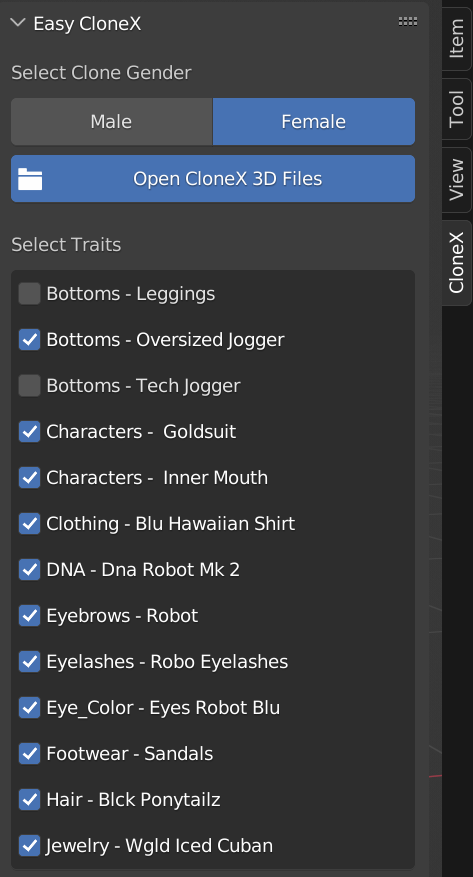

# Easy CloneX - A Blender Add-on
Easy CloneX is a Blender Add-on to simplify working with the 3D assets provided to all CloneX NFT holders by RTFKT  
  
  

## Download and Installation
1. Head over to the Releases page to download a `.zip` file of the add-on
1. In Blender, go to `Edit > Preferences` and select the `Add-ons` option on the left
1. At the top of the window, click the `Install` button and select the `.zip` file you downloaded
1. Check the box to enable the add-on 

## Functionality
Easy CloneX adds a new panel to the 3D View in Blender, which you can access by clicking on the small left arrow in the upper-right corner of that view. This panel allows you to load your base clone file and then check the boxes next to the traits/wearables/DNA textures you'd like to apply. If you change your mind, you can uncheck the boxes and those objects will be hidden from the viewport and rendering.   
  

## Usage  
Before you begin, make sure you have extracted all of your clone 3D files to a single directory with nothing else in it. Once you've extracted all of the files, you should be left with a set of directories like this:

 

Now open Blender and click on the arrow to pop out a the side panel with some vertically aligned tabs on the right side. Once you have the panel open, follow these steps:  

1. Click on the vertical tab named `CloneX`
1. Click the button that says `Open Base Clone` 
1. Using the file dialog, navigate to your base clone `.blend` file and open it. This file can be found in the `Characters-character_neutral_neutral-Combined` directory where you extracted all of your 3D files. In that directory, you should find the base clone file under `/_male/_blender` or `/_female/_blender` depending on the gender of your clone. It will be named something like `m_character_neutral_neutral.blend`.
1. Click `Open Clone` and you will see the base clone load into the 3D View
1. Below the button, you will now see a `Select Traits` section corresponding to the rest of the 3D file directories you extracted
1. Use the checkboxes to load and apply the traits/wearables/DNA textures

**DISCLAIMER**  
This is the first Blender add-on I've written and my experience with Blender (or any 3D modeling software for that matter) began when the 3D files for clones were released. It is quite possible I'm doing things inefficiently or flat-out wrong so please feel free to give me feedback/suggestions on how to improve the add-on. I can be reached on the RTFKT discord (@TheRealBGoat#1111), on twitter [@0xBGoat](https://twitter.com/0xBGoat) or by opening an issue in this repo.

